# Antenatal Care (ANC) Registry System Design { #rmncah-anc-design }

## Background and purpose

This document describes a DHIS2 Tracker configuration for Antenatal Care (ANC), or care during pregnancy at primary healthcare level. This DHIS2 Tracker configuration is designed to match as closely as possible to the [World Health Organization (WHO) Digital Adaptation Kit (DAK) for Antenatal Care (ANC)](https://www.who.int/publications/i/item/9789240020306) (2021) and hence we recommend users to refer to the DAK documentation and [Web Annexes](https://www.who.int/publications/i/item/9789240020306) at WHO website for a broader conceptual  understanding of this use case. The document also points out the key changes made in the process of adaptation of WHO’s ANC DAK into the reference configuration of DHIS2 Tracker.

In 2016, the WHO released comprehensive recommendations on antenatal care (ANC) for a positive pregnancy experience.

In contrast to the basic or four-visit focused ANC model, the [2016 WHO guidelines for ANC](https://www.who.int/publications/i/item/9789241549912) recommends interventions to be delivered at a minimum of eight ANC contacts. The new guideline not only provide recommendations on standard maternal and foetal assessments, but also on nutrition during pregnancy, on prevention and treatment of physiological problems commonly experienced during pregnancy (e.g. nausea, heartburn, etc.), and on preventative interventions for certain public health contexts (e.g. malaria and/or HIV endemic areas). The guidelines further  include recommendations on counselling and supporting women who may be experiencing intimate partner violence.

In addition, the WHO has recommended use of Digital Health Interventions (DHI) in ANC for positive pregnancy experience, as part of the Guideline Recommendations for Digital Health Interventions.

Digital Adaptation Kits (DAKs) are part of the WHO’s SMART guidelines initiative and include data and health content consistent with WHO’s antenatal clinical care recommendations. The WHO ANC DAK provides a comprehensive list of data elements for various services and stages in a typical ANC program. Health ministries and other agencies offering ANC care can choose the relevant data elements and tracked entity attributes according to local contexts and national health guidelines.To assist countries in monitoring implementation of the new WHO ANC model, nine core indicators are proposed within the DAK, which  should be used according to local contexts and the ANC services offered in the national health programs.

This Tracker was initially developed in collaboration with the Norwegian Institute of Public Health, as part of the Building Stronger Institutions and Systems (BIS) program. The ANC Registry is currently being implemented in a research project in primary health care centers across two districts of Uganda, in collaboration between the Makerere University School of Public Health, HISP Uganda, Norwegian Institute of Public Health, University of Oslo and the University of Bergen. This version based on the ANC DAK was used as a baseline demo configuration of DHIS2 during partner consultations. It is currently being contextualised for the Ugandan setting.

Because the program is intended to be deployed in primary health care centers only, sections of the ANC DAK relating to business processes for “ANC health promotion follow-up in the community”  (Workflow ANC.C) and “ANC referral to higher level facility” (Workflow ANC.D) were considered out of scope, and are excluded from this Tracker.

## System design overview

### Use case

The ANC metadata package comprises a DHIS2 Tracker program designed to register and conduct follow up during the entire phase of antenatal care at primary care level, district level or at tertiary care level. The program is designed and configured to track pregnant women for a minimum of 8 antenatal care visits from registration through closing of the ANC record. This tracker program contains around 616 data elements spread across 7 program stages. The data elements provided by the WHO are comprehensive across program stages, therefore selection of relevant and suitable data elements while adapting this program for local use is critically important, so that the field health staff are not overburdened with unnecessary data elements.

> **Note**
>
> This metadata package needs to be contextualised and modified according to local guidelines and national health policies for antenatal care.

The ANC metadata package also provides detailed guidelines and data elements to configure [clinical decision support logic](https://apps.who.int/iris/bitstream/handle/10665/339741/WHO-SRH-21.2-eng.xlsx) for antenatal care services, as well as 13 program indicators based on the individual level data. Additional aggregate indicators can be calculated from the data elements and program indicators according to needs of the program.

The ANC tracker program is specifically designed to collect point-of-care data at clinical level to improve the care services. Because the ANC metadata package can be configured with relevant clinical decision support logics to identify and treat symptoms, it is ideal that the data entry is conducted by the clinical staff during or soon after completion of patient care. However, point-of-care data collection may not be feasible in all contexts, and therefore public health managers must carefully consider the costs of training and equipping clinical ANC staff to enter data, the perceived benefits to quality of care through automated decision support, and how to incorporate secondary data entry (data initially collected at the facility on paper and later digitised by dedicated staff).

The ANC tracker captures very granular level data across pregnancy, which when aggregated can be useful for decision makers at district and national level administrators, as well as health worker supervisors at facility level.  While the ANC DAK describes analytic requirements, it does not provide mockup dashboards or visualisations of these indicators. UiO implementers and NIPH researchers have developed a sample dashboard, included within this package, to model ways in which ANC DAK indicators could be used for monitoring ANC interventions.

### Methods Used for Adaptation from ANC DAK to a DHIS2 Tracker

The ANC DAK represents Layer Two of the SMART guideline for ANC, and provides operational, software-neutral content requirements for a digital tracking and decision-

support system used by health workers during ANC. The ANC DAK document and its annexes provide comprehensive details related to design, data elements  and decision support logic for such a system.

Detailed information on ANC DAK is available at following links:

1. ANC DAK, Layer Two of the ANC [SMART guidelines](https://apps.who.int/iris/rest/bitstreams/1333082/retrieve)
2. Core Data Dictionary with data elements and definitions [Web annex A: Core data dictionary](https://apps.who.int/iris/bitstream/handle/10665/339740/WHO-SRH-21.1-eng.xlsx)
3. Decision support logic with rules and triggers [Web annex B: Decision support logic](https://apps.who.int/iris/bitstream/handle/10665/339741/WHO-SRH-21.2-eng.xlsx)
4. List of program indicators [Web annex C: Indicator table](https://apps.who.int/iris/bitstream/handle/10665/339742/WHO-SRH-21.3-eng.xlsx)

The data elements for the ANC DAK tracker program are available in the Core data dictionary Microsoft Excel Workbook under the following worksheets shown in Table 1. The worksheets provide details related to each data element that can be referred to while configuring and modifying the Tracker program.

| **Worksheet names**                | **Description**                                                                                                                                                                                                                                                                                                                                    |
|------------------------------------|----------------------------------------------------------------------------------------------------------------------------------------------------------------------------------------------------------------------------------------------------------------------------------------------------------------------------------------------------|
| _READ ME_                          | Describes how to read the data dictionary and provides important notes before beginning                                                                                                                                                                                                                                                            |
| _ANC.A. Registration_              | Data elements for the registration workflow                                                                                                                                                                                                                                                                                                        |
| _ANC.B5. Quick check_              | Data elements for conducting the quick check                                                                                                                                                                                                                                                                                                       |
| _ANC.B6. Profile_                  | Data elements for the profile task of the ANC contact workflow                                                                                                                                                                                                                                                                                     |
| _ANC.B7. Symptoms & follow-up_     | Data elements for the symptoms and follow-up task of the ANC contact workflow                                                                                                                                                                                                                                                                      |
| _ANC.B8. Physical exam_            | Data elements for the physical exam task of the ANC contact workflow                                                                                                                                                                                                                                                                               |
| _ANC.B9. Lab tests & imaging_      | Data elements for the lab tests and imaging task of the workflow                                                                                                                                                                                                                                                                                   |
| _ANC.B10. Counselling & treatment_ | Data elements for the counselling and treatment task of the workflow                                                                                                                                                                                                                                                                               |
| _ANC.C. Referral_                  | Data elements for the referral workflow                                                                                                                                                                                                                                                                                                            |
| _ANC.D.End_                        | Data elements for reasons for closing ANC record, delivery details and cause of death                                                                                                                                                                                                                                                              |
| _ANC Site-specific configuration_  | Data elements of parameters to support the adaptation and configuration according to the implementation context. These include general population characteristics (e.g. malaria prevalence), as well as site-specific characteristics related to services and commodities available at the implementation site (e.g. availability of ultrasound).  |
| _References_                       | List of references                                                                                                                                                                                                                                                                                                                                 |

Table 1 Data Element worksheet names and their description

These files were adapted for import into DHIS2 as data elements and tracked entity attributes.

**NOTE**. Data Elements in the package are prefixed according to their worksheet in the ANC DAK core dictionary. For ANC DAK Registration worksheet, these are modelled as Tracked Entity Attributes, which are typically shared across tracker programs, and are therefore not prefixed.

Where details within tabular ANC DAK documents were unclear, in particular for complex health worker workflows, UiO and NIPH consulted [Layer 4 module of the WHO ANC SMART Guidelines](https://docs.google.com/forms/d/e/1FAIpQLSfV1DYaU1Cn1-AsotEqf4eTnaaKNq0CmTiKSdd1HHcU40y3TA/viewform). This Layer consisted of an executable reference software implementing the ANC DAK, and was developed as an OpenSRP mobile application.

The ANC DAK provides concept mappings of these data elements and tracked entity attributes to other coding systems, such as ICD-11, SNOMED, and LOINC. These are modelled in DHIS2 as "Attributes"  attached to these objects. Where noted by the ANC DAK, the concept mappings are included as attribute values. For example, the data element for "Cough" in Physical Exam is mapped to the ICD-10 attribute, which has a value of MD12. These mappings could potentially be helpful for data exchange with other systems.

### ANC Tracker Program Structure

In the patient flow recommended by the ANC DAK, clients seen at the clinic should first be evaluated with a Rapid Assessment and Management clinical guide. If the assessment deems that an urgent referral is necessary, they should be referred to a hospital immediately. Since this assessment should be performed _manually_ before the patient file is opened, the process is not mirrored in the ANC Tracker configuration.

Figure 1 ANC registration flow chart of a client while registering in the ANC DAK system.

In this metadata package the name of the ANC DAK tracker program is ‘Mother program’ with a Tracked Entity Type ‘Person’. Currently the program is configured to search with a minimum one attribute before registering a pregnant woman.

#### Registration and Enrollment details

The date of Registration is configured to show as ‘Enrolled’. Based on typical ages for pregnancy, validation rules are in place to prevent data entry errors in the date of birth field. If a patient is entered registered  with an age under 10 or above 49 years, there is a rule to assess her agewith a validation error “Age must be between 10 and 49 years. Please check the date of birth and/or age in years.”. Unique ID can be configured as per national health program requirement by referring to DHIS2 documentation for [TextPattern](https://docs.dhis2.org/en/use/user-guides/dhis-core-version-master/additional-information/dhis2-tutorials.html#working-with-textpattern).

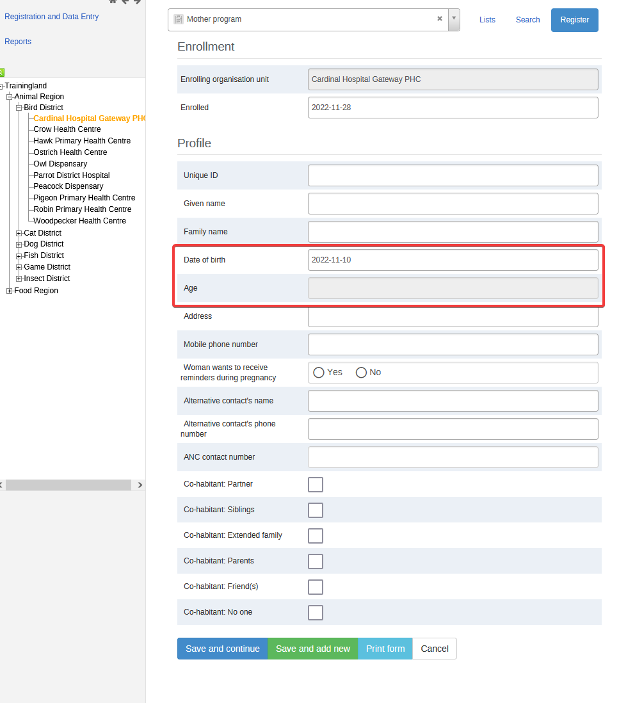

Figure 2 Enrollment with an age under 1 year

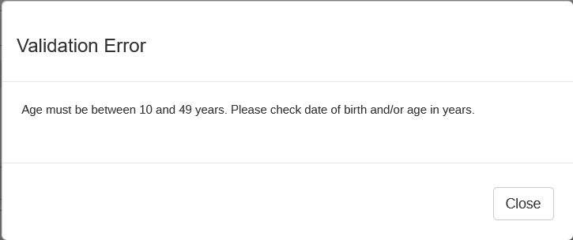

Figure 3 Validation error

##### Quick Check

After completing the enrollment details, the 'Quick Check’ program stage auto-generates, with details related to assessment for confirmation of pregnancy and danger signs. The danger signs are assessed and if there are any danger signs the program suggests to refer to hospital immediately. If there are no danger signs the clinical staff can proceed to the next program stages and relevant program sections.

Since the Quick Check stage must be performed for every visit, program indicators calculating the total number of ANC visits will by default count the number of Quick Check events in the ANC record.

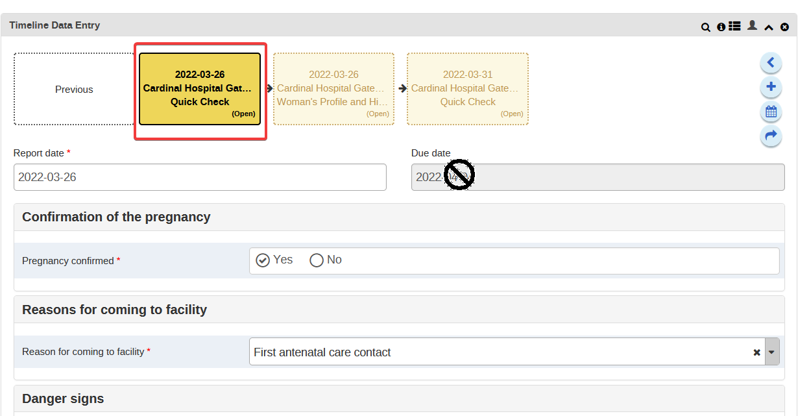

Figure 4 Quick Check details

In alignment with the ANC DAK L4 (Reference Configuration), the Quick Check stage needs to be performed at the start of every visit to assess for danger signs so that the woman can be referred to a hospital at the earliest. Such a setup works best when data entry is done concurrently with care.

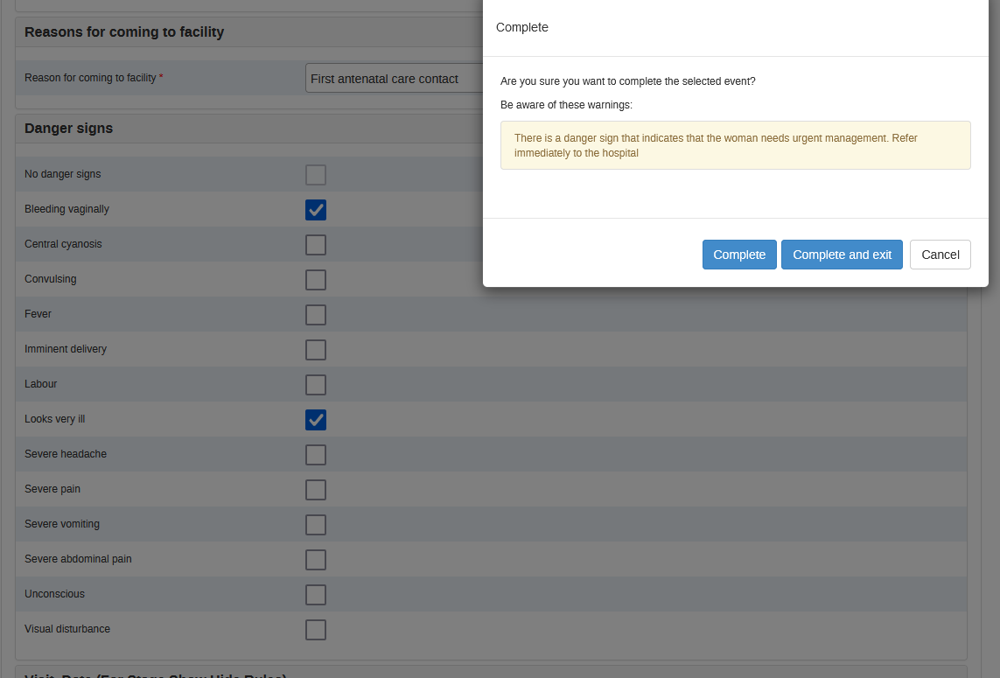

Figure 6 ANC Referral after when danger signs present

To support this use case, only the Quick Check, Laboratory, and Closure stages are first shown to data entry users by default. Once the Quick Check is performed and with **No Danger Signs** present, a program rule auto assigns the current date into the  “Date of Quick Check” data element, and the other stages (Profile and History, Symptoms, Physical Exam, Counselling) are then shown.

**The consequence is that if the latest Quick Check is not the CURRENT date, then no events can be opened for the other clinical stages.**

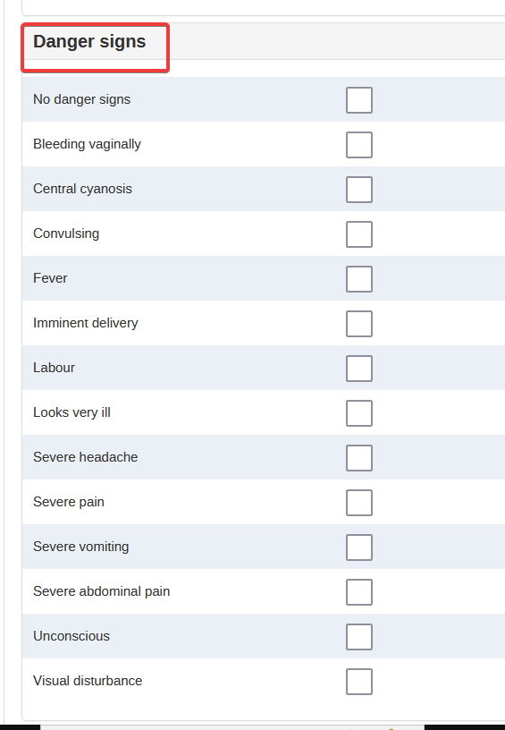

Figure 5 List of Danger signs

##### Repeatable ANC Visit Stages and Lab Tests

After conducting Quick Check at the first ANC visit a detailed Woman’s Profile and History is completed once as baseline. The Womens Profile and History stage is nonrepeatable.

Further ANC assessments are conducted using the program stages Physical examinations, Laboratory Tests and Investigations, Counselling and Treatment.Each of these program stages include data elements, both mandatory and non-mandatory.

The Symptoms, Physical Exam, Counselling & Treatment stages should be repeated during every ANC visit, including the first ANC visit.

The lab stage is repeatable, and could be entered by another user who is not at the ANC clinic. A quick check is not needed to enter lab results, and implementers might want to consider adding a separate User Group so lab users to just have access to this stage.

While customising the configuration for a specific use case these can be selected or modified as per the local guidelines. As recommended by ANC DAK, a typical ANC flow is shown in Figure 7 for quick check and counselling, management and treatment stage.

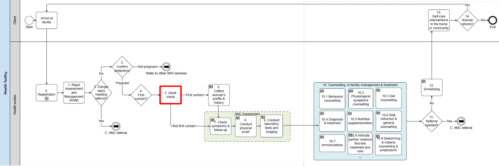

Figure 7 ANC contact flow chart for ANC assessment involving counselling, management, and treatment program stage in WHO-ANC DAK

##### Close ANC Record

Pregnancy outcomes are captured in the “Close ANC Record” stage.

Because ANC services take place in facilities while deliveries occur in hospitals, ANC closure is often overlooked during implementation of digital ANC registers at facility level.

However, in order to routinely monitor the number and quality of ANC visits provided to each client, **it is absolutely essential to close ANC records in a timely manner.**

As noted in the dashboard section below, most of the routine monitoring indicators within the ANC DAK consider the “count of all clients whose records were closed in the last reporting period” due to certain reasons, such as Live Birth or Still Birth. These monitoring indicators are retrospective from the date of file closure, because only ANC clients with sufficient opportunity to receive services should be counted in the denominator.

> **Tip**
>
> Dedicated staff should routinely follow up with patients who have not been seen at the facility in some time, in order to close the file promptly. The follow up process might include calling phone numbers from a working list of patients without a visit in the past 6 weeks, or calling women who have passed week 42 of pregnancy.

## ANC Registry Enrollment and Program Stages Details

### Enrollment details

All pregnant women between 10 and 49 years are registered and enrolled into the program as a Tracked Entity Instance (TEI), and data about the woman are captured in the enrollment as attributes. The enrollment date is configured to display ‘enrolled’ to the clinical staff. The following TEI attributes are present in the current metadata package. Additional attributes can be added according to local requirements.

| 1 | _Enrollment_ |   1. Unique ID * 2. Given name * 3. Family name * 4. Date of birth * 5. Age	 6. Address	  7. Mobile phone number 	 8. Woman wants to receive reminders during pregnancy  9. Alternative contact's name 10. Alternative contact's phone number  11. ANC contact number 	 12. Co-habitant: Partner 13. Co-habitant: Siblings 14. Co-habitant: Extended family 15. Co-habitant: Parents 16. Co-habitant: Friend(s) 17. Co-habitant: No one   * = Mandatory TEI attributes |
|---|------------|-------------------------------------------------------------------------------------------------------------------------------------------------------------------------------------------------------------------------------------------------------------------------------------------------------------------------------------------------------------------------------------------------------------------------------------------------------------------------------------------------------------------------------------------------------------------------------------------------------------------------------------------------------------------------------------------------------------------------------------------------------------------------------------------------------------------------------------------------------------------------------------------------------------------------------------------------------------------------------------|

The TEI Attribute "ANC contact number" is included within the ANC DAK Appendix A as a calculation of the number of visits. This could be interpreted as either the number of visits the ANC client had prior to being entered into the ANC registry.

The TEI Attributes starting with "cohabitants" are Yes-Only checkboxes, mimicing the "select multiple" ANC DAK question on who lives with the ANC client.

### Program Stage details

ANC DAK _Mother program_ has 7 program stages. Each of these stages contain program sections depending on the ANC visit and the stage of the pregnancy. Quick Check is mandatory for every ANC visit to check for danger signs. Woman’s Profile and History, Close ANC Records are non-repeatable stages. The other stages can be used according to the services offered by the clinical staff.
|   | **_Program Stages_**                                                    | **Program Sections**                                                                                                                                                                                                                                                                                                                                                                                                                                                                                                                                                                                                                                                                         |
|---|-------------------------------------------------------------------------|----------------------------------------------------------------------------------------------------------------------------------------------------------------------------------------------------------------------------------------------------------------------------------------------------------------------------------------------------------------------------------------------------------------------------------------------------------------------------------------------------------------------------------------------------------------------------------------------------------------------------------------------------------------------------------------------|
| 1 | _Quick Check (Repeatable every visit)_                               | _Must show "No Danger Signs" at the beginning of every ANC counter to display other stages._ Includes:   Confirmation of the pregnancy Reasons for coming to facility Specific health concerns Danger signs Visit Date                                                                                                                                                                                                                                                                                                                                                                                                                                                                                                                                                                    |
| 2 | _Woman's Profile and History (**Non-repeatable**)_                   | This is a non-repeatable stage that captures the information related to a woman's social, medical and pregnancy and immunization related history. Following program sections are present:  Education Occupation Gestational age Previous pregnancies Past pregnancy complications Past pregnancy complications Substance use during past pregnancy Allergies Past surgeries Existing chronic health conditions Immunisation history Current medications Daily caffeine intake Current alcohol and/or other substance use Partner HIV status (reported)                                                                                    |
| 3 | _Symptoms and Follow-up (Repeatable)_                                | This a repeatable stage that is performed at every visit to capture details related to medications, persistent behaviours, physiological symptoms and IPV Following program sections are present: Medication follow-up Persistent behaviours Persistent physiological symptoms Current physiological symptoms Intimate partner violence Foetal movement                                                                                                                                                                                                                                                                                                                 |
| 4 | _Physical Examinations (Repeatable)_                                 | This is a repeatable stage with sections related to physical examinations. This stage provides opportunities to configure decision support logics for most common measurements and symptoms. Blood pressure section has a working decision support logic ( see Decision support logic below) Following program sections are present:  Height and Weight Blood pressure Symptoms of severe pre-eclampsia Temperature, Pulse, and Pallor Respiratory exam result Cardiac exam result Breast exam result Abdominal exam result Pelvic exam result Cervical exam result Oedema Fetal assessment Presenting signs/conditions for IPV Types of IPV |
| 5 | _Laboratory Tests and Imaging (Repeatable)_                          | This is a repeatable stage that is used once at first ANC visit and later as and when required. Following program sections are present:  Ultrasound scan Blood type and Rh HIV test Hepatitis B virus test and result Hepatitis C test and result Syphilis test and result Urine tests Urine test type Midstream urine culture result Results of other urine tests Blood glucose tests Blood Haemoglobin TB screening Reason TB screening not done Other tests                                                                                                                                                                            |
| 6 | _Counselling and Treatment (Repeatable)_                             | This is a repeatable stage related to counselling  related to risks, immunization, IPV and malaria prevention treatment. This stage has 14 program sections and many data elements.  Following program sections are present:  Behavioural counselling Diagnoses Risks of high-risk conditions and counselling HIV: Risk, Counselling and prevention Danger signs Counselling on ANC contacts and Birth Plan TT immunization Hep B immunization Flu immunization IPV IPV- Safety assessment IPV- Referrals made as part of first-line support and care Preventive treatment Malaria prevention and treatment                               |
| 7 | _Close ANC Record (**Non-repeatable**, once at closing ANC records)_ | This is a non-repeatable section that is done when closing the ANC records. Following program sections are present:  Reason for closing ANC record Delivery related information Breast Feeding Delivery complications Miscarriage, Abortion or Maternal Death                                                                                                                                                                                                                                                                                                                                                                                                           |

Table 2 ANC Tracker Program Stages

### Program Stages on Android and Web

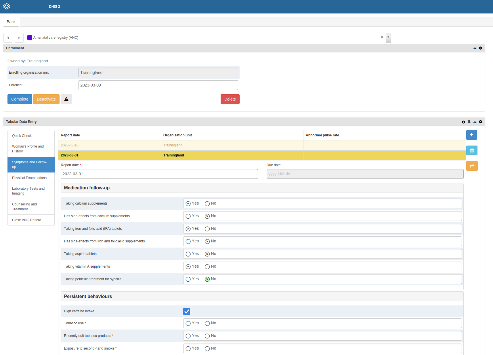

Figure 8 ANC DAK Program stages in a browser

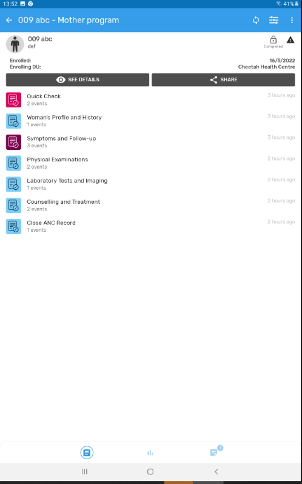

Figure 9  ANC DAK Program stages on an Android device

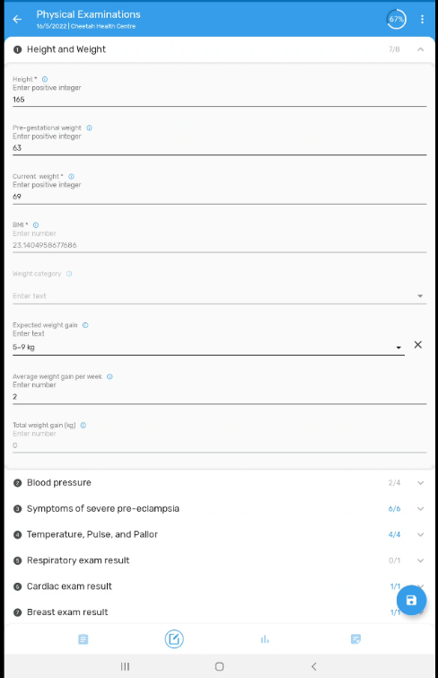

Figure 10 Program section details of Physical Examination Stage on an Android device

### Decision Support Logic example

The decision-support logic component of ANC DAK package provides the decision-support logics and algorithms, as well as the scheduling of services, in accordance with WHO guidelines. Each decision-support logic consists of at least one business rule, trigger, input, output and action. The [Web annex B: Decision support logic](https://apps.who.int/iris/bitstream/handle/10665/339741/WHO-SRH-21.2-eng.xlsx) Excel Worksheet provides details related to each program stage. There are thousands of decision support logics that are recommended by WHO for various stages and symptoms. Before implementation, national subject matter experts, policy makers and local users need to be consulted while selecting the appropriate decision support logic for the symptoms and services.

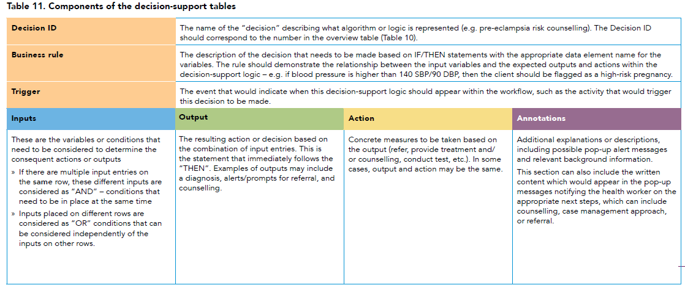

Table 3 Components of the decision-support logic

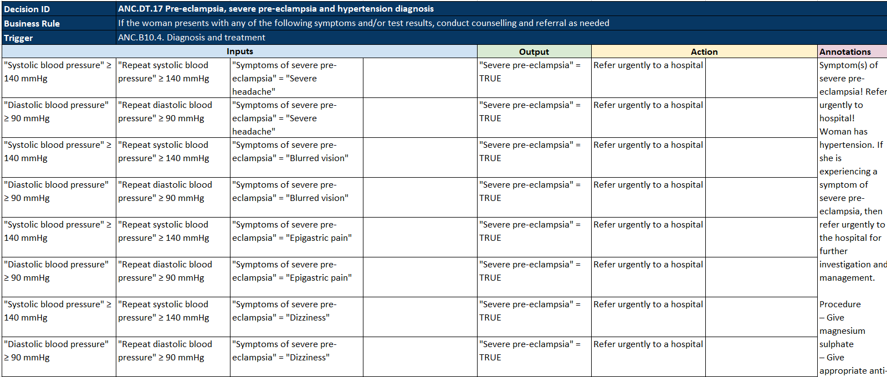

Table 4 An example of a decision-logic table for Severe pre-eclampsia and hypertension diagnosis

Please refer to the “ANC.DT.17–24 Diagnosis & treat” worksheet in [Web annex B: Decision support logic](https://apps.who.int/iris/bitstream/handle/10665/339741/WHO-SRH-21.2-eng.xlsx) for relevant inputs, output, action and annotations for all available decision rules for Diagnosis & Treatment.

Often, multiple tables of decision support need to be evaluated to develop a cascade of related actions. For example, diagnosis for hypertension depends on a high **repeat** blood pressure measurement, which is only shown to the user after the first high measurement.

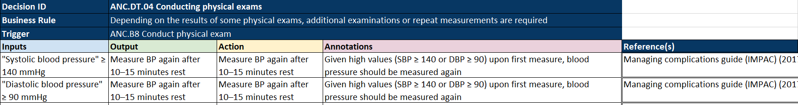

Table 5 Decision rule details for blood pressure

The following is an example for the decision rule for blood pressure under the Physical examination program stage.  It follows the ANC DAK trigger for a second blood pressure measurement, and then a treatment for severe hypertension, both shown above.

1. When a systolic blood pressure input is more than 140 mmHg and diastolic blood pressure input more than 90 mmHg, the program activates a pop-up Warning Box with an action to ‘Measure BP again after 10-15 minutes rest’.
2. After taking the repeat blood pressure, additional boxes for “Diagnosis” and “Treatment Note” are shown.  The decision logic is be configured using program rules to show  ‘Severe Hypertension’ as the Diagnosis,  with a instructions on how to treat this diagnosis autofilled as an annotation in the ‘Treatment Note’ data element.
3. After reading the treatment note, the provider confirms they have read the note and provided treatment as needed, by clicking the Yes Only data element beneath the 'Treatment Note'. This flexibility allows for the care provider's discretion on how to actually administer treatment, but ensures their recognition of the decision support guidance.

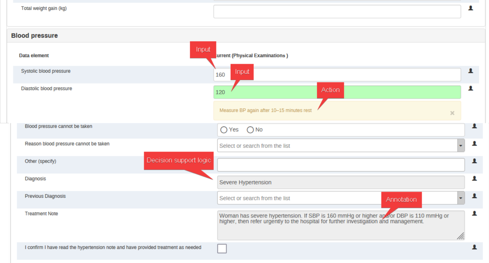

Figure 11 Decision logic inputs, output, action and annotations for blood pressure

## Program Rules

To support data quality, the ANC Registry program uses many program rules to assess data element values according to validation conditions and skip logic. Details for each of the data elements can be found in the [Web annex A: Core data dictionary](https://apps.who.int/iris/bitstream/handle/10665/339740/WHO-SRH-21.1-eng.xlsx) worksheet. Every program stage has data elements that are mandatory, and some data elements that need to be checked for particular validation. In some cases,  data inputs may lead to certain program rules acting as diagnostic support tools, suggesting to the user that they  a particular symptom should be checked and confirmed.

Few examples of program rules are shown below.

1. Program rule to check for cervical dilation with an acceptable range 0 cm -10cm. If the range is out of this there will be an error message _”Out of range. Acceptable range: 0 cm-10 cm”_

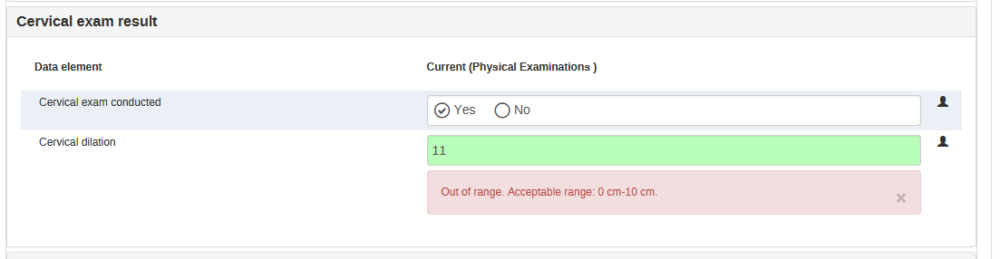

2. Program rule to check for LMP date based on visit date, which should  not be less than 2 weeks and not more than 40 weeks.

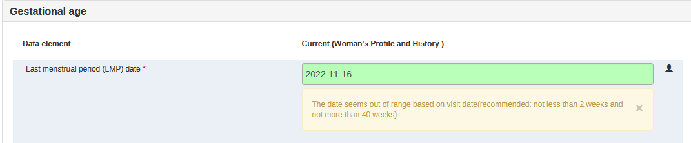

3. Program rules to check for a woman’s previous pregnancies related to gravida, para, live births and abortions. The rule will show an error if the number of live birth is more than previous pregnancies minus number of miscarriages/abortions. There is also a similar rule to check for the number of stillbirths.

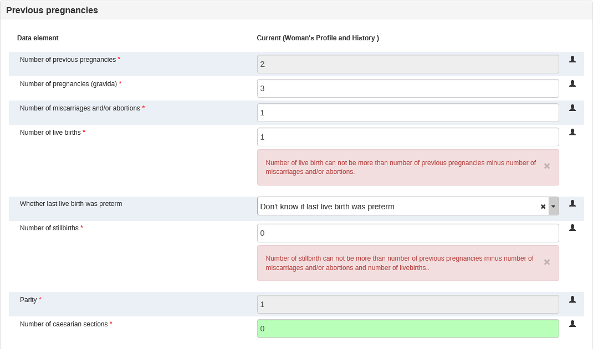

4. Program rules for BMI calculation and weight category take mandatory inputs from Height and Weight to calculate BMI value and then classify as underweight, normal, overweight and obese categories.

###

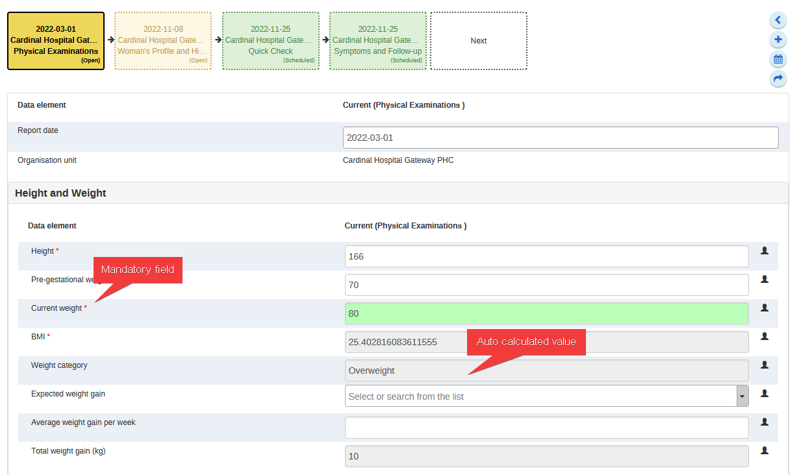

## User groups

The following user groups are included in the ANC Registry package:

* ANC Admin: can edit/view metadata; no access to data  in all program stages

* ANC Data capture: can view metadata, can capture data in all program stages, no access to dashboards

* ANC Access: can view metadata, can view data in all program stages

## Analytics

### Indicators

WHO ANC DAK provides 13 indicators - 10 Core Indicators and 3 Context- Specific Program Indicators. Details related to these indicators can be found at WHO webpage at [Web annex C: Indicator table](https://apps.who.int/iris/bitstream/handle/10665/339742/WHO-SRH-21.3-eng.xlsx)

The core program indicator Excel sheet provides details related to numerator, denominator, computation, definition, and disaggregation related to age and education levels.

Only core indicators (1-10) are provided as part of this package. Additional indicators, includign disaggregations, can be created using the program indicators and required data elements according to the need and requirement of clinic, district and national level.

|           **Indicator code**          |                                                           **Indicator name**                                                           |
|:-------------------------------------:|:--------------------------------------------------------------------------------------------------------------------------------------:|
|           _Core Indicators_          |                                                                                                                                        |
|               ANC.IND.1               |                Percentage of pregnant women with first ANC contact in the first trimester (before 12 weeks of gestation)               |
|               ANC.IND.2               |                      Percentage of pregnant women who received iron and folic acid (IFA) supplements for 90+ days                      |
|               ANC.IND.3               |                                      Percentage of pregnant women screened for syphilis during ANC                                     |
|               ANC.IND.4               |                                      Percentage of pregnant women with at least four ANC contacts                                      |
|               ANC.IND.5               |                              Percentage of pregnant women with a minimum of eight antenatal care contacts                              |
|               ANC.IND.6               |                       Pregnant women who received counselling on danger signs (%) during at least one ANC contact                      |
|               ANC.IND.7               |                            Percentage of pregnant women with at least one blood pressure measure during ANC                            |
|               ANC.IND.8               |                 Percentage of pregnant women with at least one blood pressure measure in the third trimester during ANC                |
|               ANC.IND.9               |                      Percentage of pregnant women whose baby’s heartbeat was listened to at least once during ANC                      |
|               ANC.IND.10              |                                  Percentage of pregnant women with an ultrasound scan before 24 weeks                                  |
| _Context specific Program Indicators_ (excluded) |                                                                                                                                        |
|               ANC.IND.11              | Percentage of women who received three doses or more of intermittent preventive therapy for malaria (IPTp) during their last pregnancy |
|               ANC.IND.12              |                                       Percentage of pregnant women counselled and tested for HIV                                       |
|               ANC.IND.13              |                             Percentage of pregnant women who received oral pre-exposure prophylaxis (PrEP)                             |

### Program Indicators

Aggregate indicators have been generated for the core DAK indicators above, with program indicators serving as numerators and denominators. Program indicators count the number of ANC records that meet certain conditions. Note that the program indicators and indicators use a similar coding schema at the start to align with the ANC DAK indicator codes.

### Dashboards

The ANC DAK does not propose a specific analysis framework for the Indicators described. As proof of concept, one dashboard is included as part of the package.

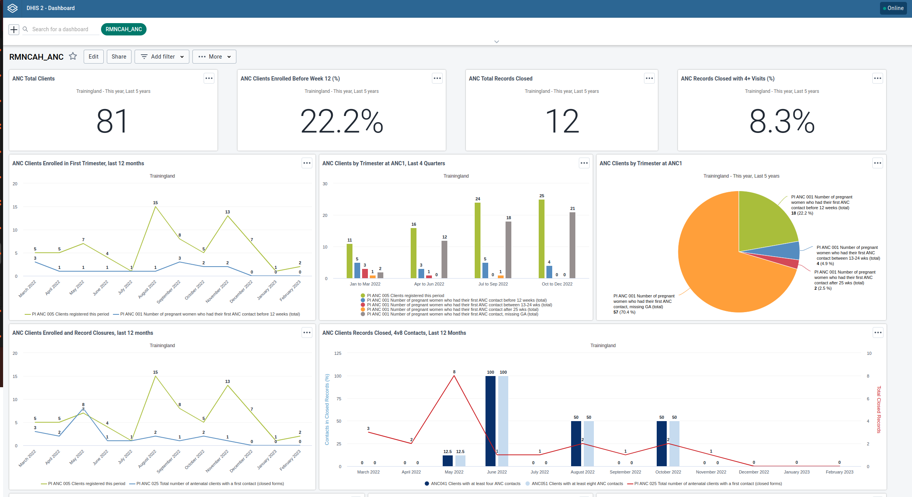

The purpose of the dashboard is to present the core ANC DAK indicators. In order to present those performance indicators in appropriate context, information should be provided on total number of registrations, early start of ANC treatment (i.e. gestational age at first visit), and the number of closed ANC records.

The dashboard therefore also assesses implementation status of the ANC Registry.

It includes **five** basic sections.

* Headline cumulative figures (total clients, enrolled before week 12, total records closed, records closed with 4+ visits)

* Trends in client registration by gestational age at ANC1

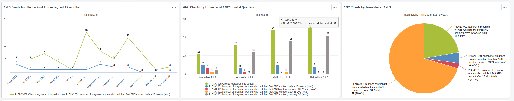

* Monthly comparison of clients registered, record closures, records closed with 4+ visits, and records closed after 8+ visits

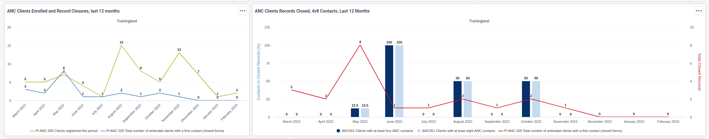

* Closure reasons, and a summary overview of all core indicators by month and year

* A description box with more indicator information

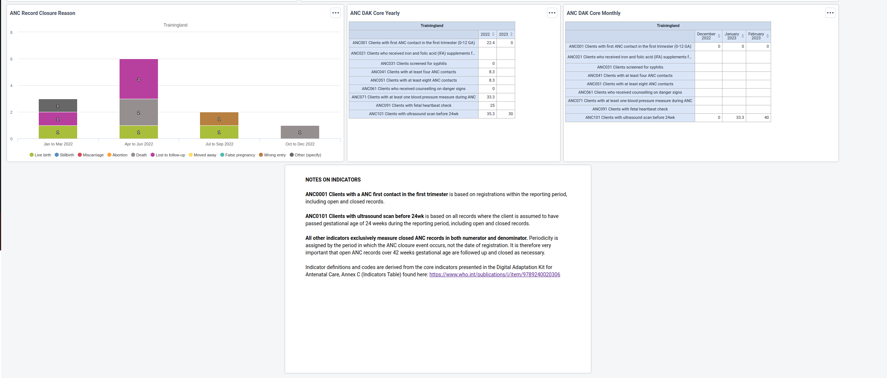

## Android compatibility

ANC DAK data packages are optimised for Android data collection with the DHIS2 Capture App, free to download on the [Google Play store](https://play.google.com/store/apps/details?id=com.dhis2&hl=en) or at [Github](https://github.com/dhis2/dhis2-android-capture-app/releases).

See also the [Android Web Settings App](https://docs.dhis2.org/en/use/android-app/settings-configuration.html) for tailoring configuration of the DHIS2 Capture App on Android, including setting important synchronization parameters such as maximum number of TEI to download onto each device.

## Performance considerations

Since ANC Registry program captures individual, point-of-care data that needs to synchronise metadata and data frequently, it is advisable to check for compatible Android devices at [Mobile Device Specifications](https://docs.dhis2.org/en/implement/android-implementation/mobile-device-specifications.html) page. Tracker programs with hundreds of program rules will generally require a more powerful device than in an implementation where you are collecting aggregate data.

## References

* Digital Adaptation Kit for Antenatal Care: Operational requirements for implementing WHO recommendations in digital systems [https://www.who.int/publications/i/item/9789240020306](https://www.who.int/publications/i/item/9789240020306)

* Instruction Manual for the WHO Antenatal Care Recommendations Adaptation Toolkit [https://www.srhr.org/docs/default-source/documents-for-tools-tag/who_anc-instruction-manual_proof3_19mar.pdf?sfvrsn=aff44709_6](https://www.srhr.org/docs/default-source/documents-for-tools-tag/who_anc-instruction-manual_proof3_19mar.pdf?sfvrsn=aff44709_6)

* ANC DAK Web annex A: Core data dictionary [https://apps.who.int/iris/bitstream/handle/10665/339740/WHO-SRH-21.1-eng.xlsx](https://apps.who.int/iris/bitstream/handle/10665/339740/WHO-SRH-21.1-eng.xlsx)

* ANC DAK Web annex B: Decision support logic [https://apps.who.int/iris/bitstream/handle/10665/339741/WHO-SRH-21.2-eng.xlsx](https://apps.who.int/iris/bitstream/handle/10665/339741/WHO-SRH-21.2-eng.xlsx)

* ANC DAK Web annex C: Indicator table [https://apps.who.int/iris/bitstream/handle/10665/339742/WHO-SRH-21.3-eng.xlsx](https://apps.who.int/iris/bitstream/handle/10665/339742/WHO-SRH-21.3-eng.xlsx)

## Acknowledgements

* WHO Department of Digital Health and Innovations (DHI)

* WHO Department of Sexual and Reproductive Health and Research (SRH)

* Norwegian Institute of Public Health (NIPH)

* HISP-University of Oslo (HISP-UiO)

* Makerere University School of Public Health

* HISP-Uganda

* University of Bergen (UiB)

* NORAD
